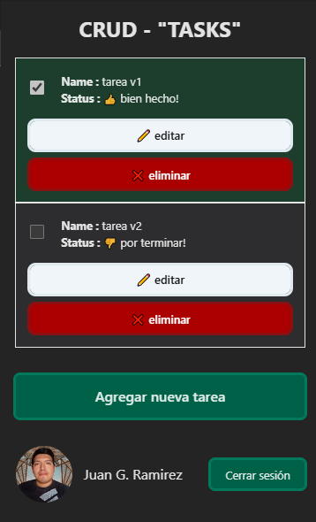

# CRUD-AUTH-SUPABASE-REACT
<div style="display: flex; gap: 10px; justify-content: center; items-center: center">
  
    
</div>

- Proyecto de tareas realizado con react y supabase utlizando base de datos y autenticacion con google del servicio.

- Tienes que registrarte mediante google email y podras realizas las siguientes acciones basicas del crud, obtener tareas, actualizar, eliminar o crear tareas segun el usuario registrado en la pagina.

### Tecnologias

[](https://skillicons.dev)

### Endpoints:

```typescript
  GET / -> ruta principal
  GET /dashboard -> ruta panel principal
```
### Recursos

- Supabase docs: 
[https://supabase.com/docs/reference/javascript/installing](https://supabase.com/docs/reference/javascript/installing)
#### Finalizado: 07-10-2024
